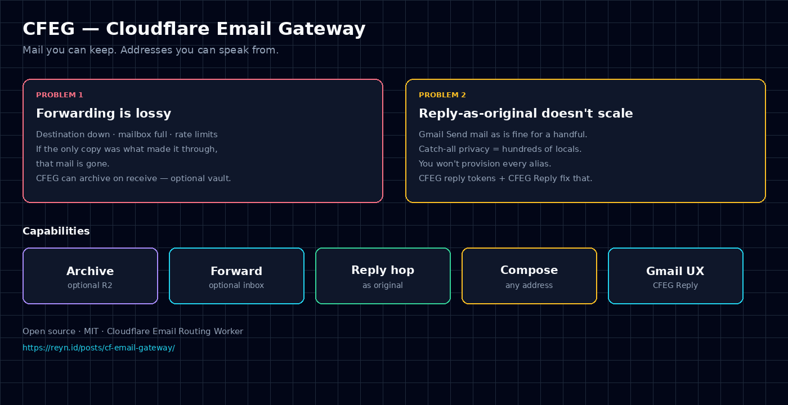
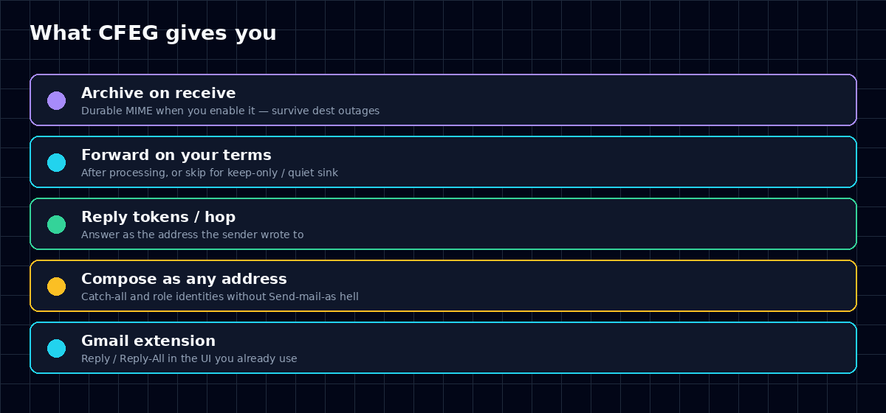
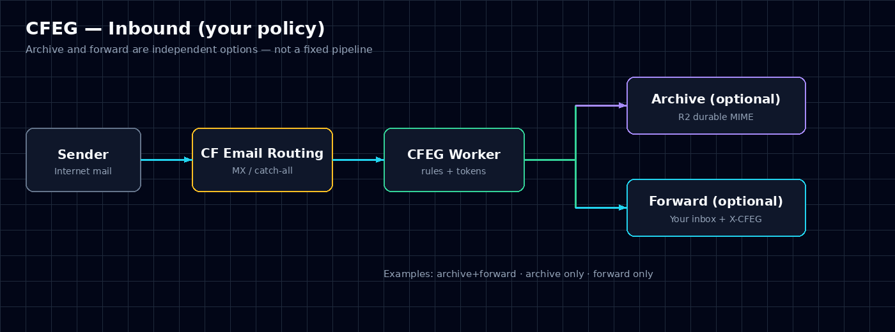
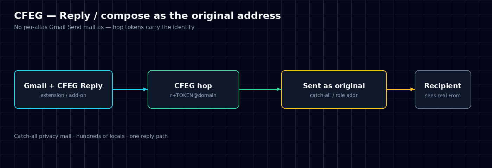

# CFEG — Cloudflare Email Gateway

<p align="center">
  
</p>

<p align="center">
  <strong>Self-hosted email control plane on Cloudflare Email Routing.</strong><br/>
  Optional archive · optional forward · reply &amp; compose as any address on your domain
</p>

<p align="center">
  <a href="LICENSE"></a>
  <a href="docs/18-installation.md"></a>
  <a href="https://github.com/reynhartono/cfeg-reply-extension"></a>
</p>

Deploy a Worker in front of your catch-all. **You** own the routing YAML, R2 archive, SMTP, and policy.

---

## The pitch

Plain Email Routing forward is fine until it isn’t:

| Pain | What breaks | What CFEG adds |
|------|-------------|----------------|
| **Best-effort forward** | Dest down, full mailbox, rate limits → mail can vanish | **Optional archive** on receive (R2) so the domain keeps a copy |
| **Identity at scale** | Gmail “Send mail as” tops out at a few aliases | **Reply tokens + hop** so catch-all / role addresses stay speakable |
| **Privacy aliases** | `netflix@…`, `github@…`, `that-one-marketplace@…` | One gateway path for **reply & compose** as the real local-part |
| **Gmail UX** | Custom hop headers are invisible to native Reply | **[CFEG Reply](https://github.com/reynhartono/cfeg-reply-extension)** rewrites Reply / Reply-All |

Archive and forward are **independent toggles**. Run vault-only, forward-only, or both — your YAML, your call.

---

## Product surface

<p align="center">
  
</p>

| Module | You get |
|--------|---------|
| **Ingest** | Catch-all → Worker; rules + `default_inbox`; Message-ID-aware handling |
| **Archive** | Optional full MIME → R2; success policy ties archive + delivery when enabled |
| **Deliver** | `cf_forward` to your inbox with **X-CFEG-\* v2** hop metadata |
| **Reply hop** | `r+TOKEN@yourdomain` → SMTP as the original mailbox |
| **Compose / send-proxy** | HTTP compose + `alias+user=domain@you` proxy from authorized senders |
| **Observability** | D1 delivery attempts; retries skip work that already succeeded |
| **Gmail client** | Separate MIT extension: Reply / Reply-All → hop tokens |

---

## Architecture

### Inbound

<p align="center">
  
</p>

```text
Sender → Cloudflare Email Routing → CFEG Worker
                                      ├─ archive?  → R2
                                      └─ forward?  → inbox (+ X-CFEG headers)
```

### Outbound identity

<p align="center">
  
</p>

```text
Gmail (CFEG Reply) / API / send-proxy
        → CFEG hop (token)
        → SMTP as the real address on your domain
```

No “provision every alias in Gmail.” The gateway is the identity plane; the inbox is where you read.

---

## Who ships this

- Operators already on **Cloudflare Email Routing**
- Catch-all **privacy** domains (unique local-part per service)
- Teams with **many role / brand** addresses on one apex
- Anyone who wants a **receive log** that isn’t “hope Gmail got it”

Background / narrative (blog): [reyn.id — CFEG](https://reyn.id/posts/cf-email-gateway/)

---

## Stack (what you run)

| Piece | Role |
|-------|------|
| **Cloudflare Worker** | This repo |
| **D1** | Message + attempt metadata |
| **R2** | Optional MIME archive |
| **Email Routing** | Catch-all → Worker name `cf-email-gateway` |
| **SMTP** (e.g. your ESP) | Compose, reply hop, send-proxy (DATA, 1:1 bodies) |
| **Secrets** | `ROUTING_YAML`, `SMTP_*`, optional `COMPOSE_API_TOKEN` |

Config is **YAML you control** (example in-repo for copy-paste; **live value must be Worker secret `ROUTING_YAML`** — no silent example fallback). Synthetic fixtures only in git (`example.com` / `me@gmail.com`).

---

## Quick start

**Full install:** [docs/18-installation.md](docs/18-installation.md)

```bash
git clone https://github.com/reynhartono/cf-email-gateway.git
cd cf-email-gateway
npm install && npm test
```

**Production (short path):**

1. `npx wrangler login` (or `CLOUDFLARE_API_TOKEN`)
2. Create D1 + R2 → `cp wrangler.toml.example wrangler.toml` (bind `DB` / `ARCHIVE`)
3. `npx wrangler d1 migrations apply cf-email-gateway --remote`
4. Copy [`config/routing.example.yaml`](config/routing.example.yaml) → local file →  
   `npx wrangler secret put ROUTING_YAML < config/routing.local.yaml`
5. Secrets: `SMTP_HOST`, `SMTP_USERNAME`, `SMTP_PASSWORD` (+ optional `SMTP_PORT`, `COMPOSE_API_TOKEN`)
6. `npx wrangler deploy`
7. Email Routing catch-all → Worker **`cf-email-gateway`**
8. Smoke: `GET /health` must show `"routing_ok":true`, then authenticated smtp-selftest / compose, then a real inbound

**Secret changes require a redeploy.** Missing `ROUTING_YAML` fails closed (email error / HTTP 503); `/health` stays up with `routing_ok:false`.

```bash
curl -sS "https://cf-email-gateway.<account>.workers.dev/health"
# {"ok":true,"service":"cf-email-gateway","routing_ok":true}

curl -sS -H "Authorization: Bearer $COMPOSE_API_TOKEN" \
  "https://cf-email-gateway.<account>.workers.dev/v1/smtp-selftest?to=me@gmail.com"
```

**Gmail Reply UX:** install [CFEG Reply](https://github.com/reynhartono/cfeg-reply-extension) (Chrome / Firefox).

---

## Docs map

| Doc | Purpose |
|-----|---------|
| [docs/18-installation.md](docs/18-installation.md) | Install / deploy |
| [docs/09-decisions.md](docs/09-decisions.md) | Product defaults (SoT) |
| [docs/15-x-cfeg-header-contract.md](docs/15-x-cfeg-header-contract.md) | X-CFEG v2 producer contract |
| [docs/02-config-and-routing.md](docs/02-config-and-routing.md) | Routing YAML |
| [docs/13-delivery-and-reply.md](docs/13-delivery-and-reply.md) | Forward + hop |
| [docs/17-send-proxy.md](docs/17-send-proxy.md) | Send-proxy addressing |
| [docs/16-outbound-smtp-vs-api.md](docs/16-outbound-smtp-vs-api.md) | SMTP DATA |
| [docs/README.md](docs/README.md) | Full index |

---

## License

[MIT](LICENSE)
